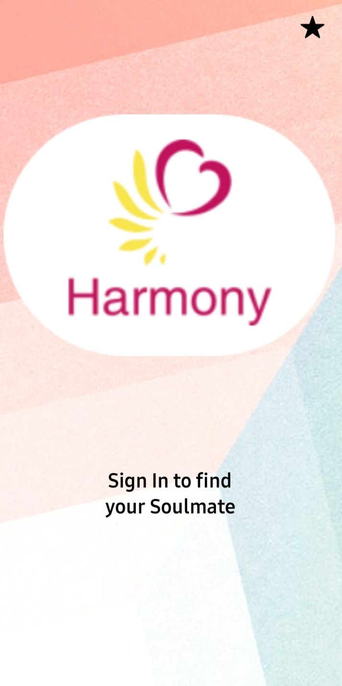
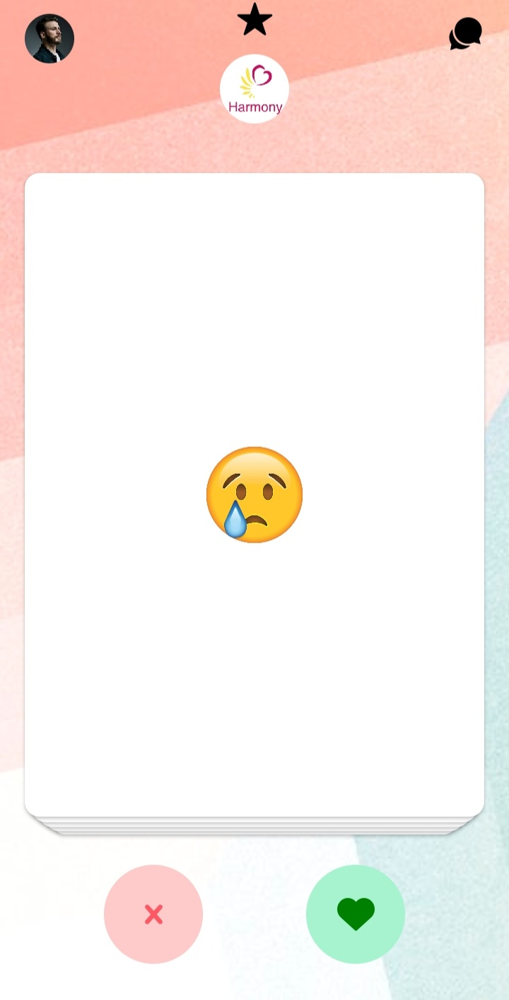
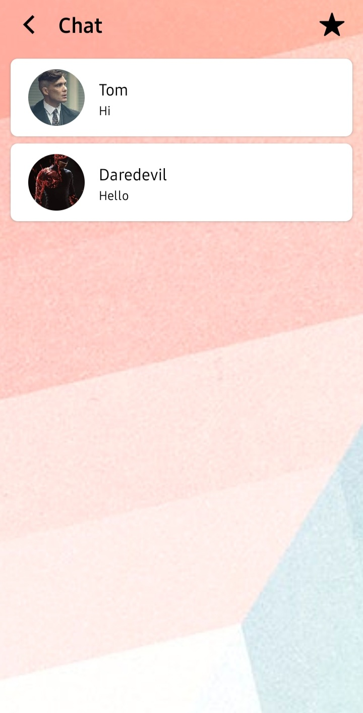
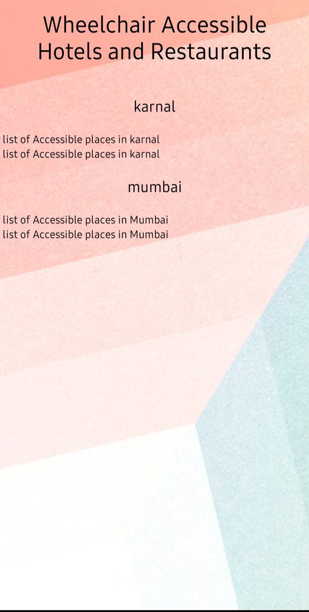

# HARMONY - DATING APP FOR SPECIALLY ABLED PEOPLE

This app is  made using React Native and Expo. 
Tailwind CSS is used for styling. 
Firebase is used for authentication and for storing all the data.
Other features- Various hooks like useRef, useMemo, useNavigation etc are used for providing a smooth hassle-free experience to the users.  

Login Screen 
Home Screen 
Chat Screen 
Places Screen 